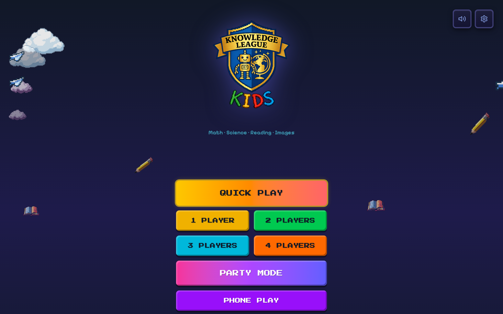
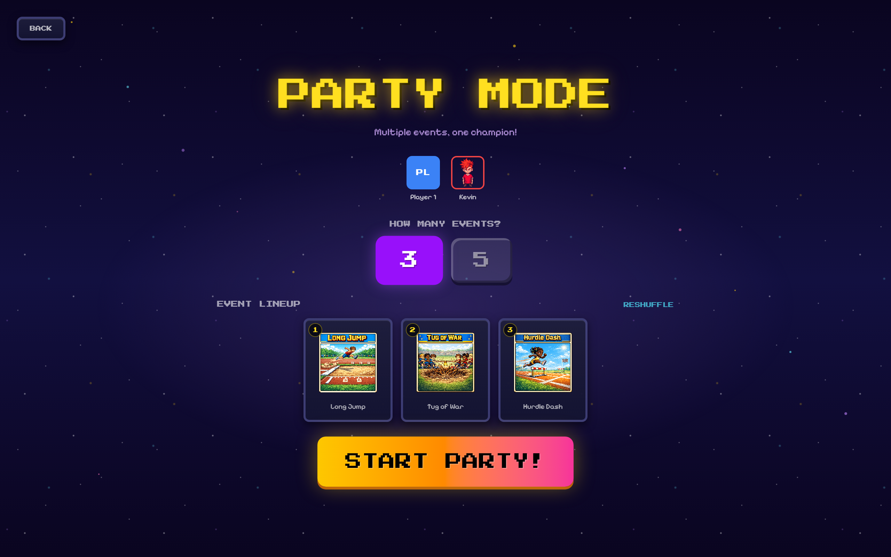
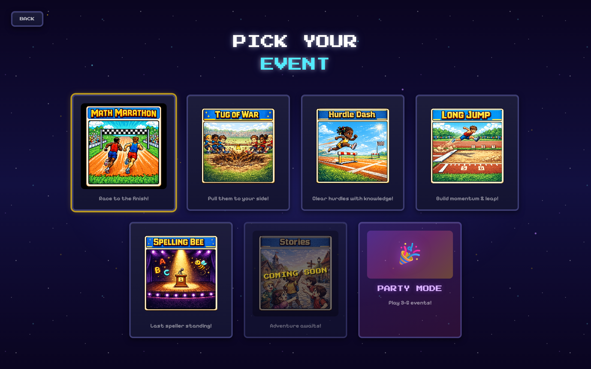
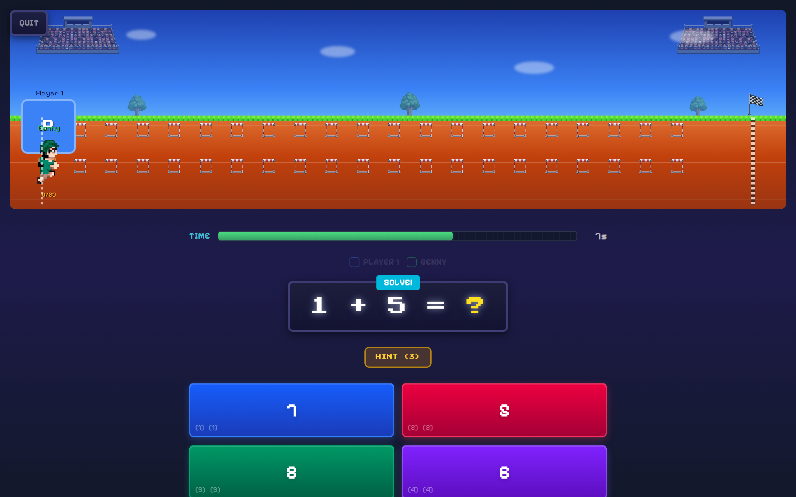
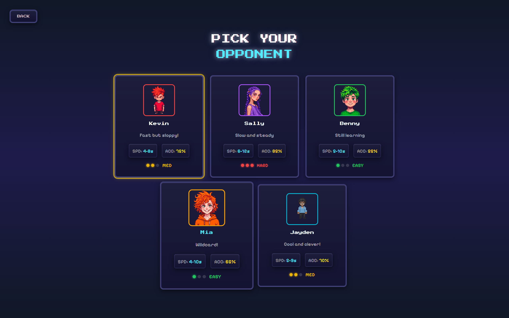

# Knowledge League Kids

The ultimate kids party game — math, science, reading, and spelling questions power retro pixel art competitions. Built with React, TypeScript, and WebRTC for instant multiplayer on any device.



## Quick Play & Party Mode

**Quick Play** — One tap, instant game. Random opponent, random event, zero setup.

**Party Mode** — The main event. Play 3 or 5 random events back-to-back with cumulative medal scoring. Gold (3 pts), Silver (2 pts), Bronze (1 pt). One champion crowned at the end.



## 5 Game Events



| Event | How It Works |
|-------|-------------|
| **Math Marathon** | Race to the finish — correct answers move you forward |
| **Tug of War** | Teams pull a rope. Streaks trigger super pulls |
| **Hurdle Dash** | Sprint and jump hurdles with fast, correct answers |
| **Long Jump** | Build speed with a streak, then launch for distance |
| **Spelling Bee** | Last speller standing wins |



## Pick Your Opponent

5 CPU characters with distinct personalities — from Kevin (fast but sloppy) to Sally (slow and steady). Each has custom pixel art and tuned difficulty.



## Features

- **Quick Play** — One button, instant game, zero friction
- **Party Mode** — Multi-event tournament with medal scoring and a party champion
- **Power-ups** — Time Freeze, Double Points, 50/50, Streak Shield — earned on hot streaks
- **Multiplayer** — Players join from their phones via QR code (WebRTC, no server)
- **CPU opponents** — 5 characters with adjustable speed and accuracy
- **Adaptive difficulty** — Questions auto-adjust based on each player's performance
- **5 subjects** — Math (procedural), science, reading, spelling, visual/counting
- **Grade levels** — Grade 1 through 3, plus Adult mode
- **AI announcer** — Qwen3 TTS voice commentary with 6 selectable voices
- **Custom characters** — Generate pixel art characters via PixelLab API
- **Streak celebrations** — Milestone animations at 3, 5, 7, and 10 correct in a row
- **Post-game stats** — Player analytics, superlatives, behavior tags, trophy shelf
- **Retro pixel art** — 16-bit characters, tilesets, and animations

## Quick Start

```bash
npm install
npm run dev
```

Open `http://localhost:5175` in your browser. No API keys needed to play.

## Environment Variables (Optional)

Copy `.env.example` to `.env` for extra features:

| Variable | What It Unlocks |
|----------|----------------|
| `REPLICATE_API_TOKEN` | AI announcer voices (Qwen3 TTS via [replicate.com](https://replicate.com/account/api-tokens)) |
| `VITE_PIXELLAB_API_KEY` | Custom pixel art character generation ([pixellab.ai](https://pixellab.ai)) |

## Multiplayer

1. Click **Phone Play** on the main menu
2. Players scan the QR code on their phones
3. Phones become controllers — host screen shows the game
4. Works peer-to-peer via WebRTC, no server needed

## Scripts

```bash
npm run dev          # Dev server (localhost:5175)
npm run build        # TypeScript + production build
npm run lint         # ESLint
npm test             # Unit tests (Vitest)
npm run test:browser # E2E tests (Playwright)
```

## Tech Stack

- **React 19** + **TypeScript** + **Vite** + **Tailwind CSS v4**
- **Zustand** for state management
- **PeerJS** (WebRTC) for multiplayer
- **Vitest** + **Playwright** for testing
- **Qwen3 TTS** via Replicate for AI voices
- **PixelLab API** for AI-generated pixel art

## Project Structure

```
src/
  components/
    Menu/              Main menu with Quick Play and Party Mode
    MathMarathon/      Marathon race event
    TugOfWar/          Tug of war event
    HurdleDash/        Hurdle dash event
    LongJump/          Long jump event
    SpellingBee/       Spelling bee event
    PartyMode/         Party setup, transitions, and final results
    Victory/           Victory screen (single event + party mode)
    PostGameStats/     End-of-game analytics and superlatives
    PhoneController/   Mobile player controls
    shared/            Reusable (MathProblem, Timer, Effects, PowerUpDisplay)
  hooks/               useGameState, useSettings, useCPU, usePeerHost, etc.
  utils/               questionEngine, mathProblems, adaptiveDifficulty, sounds, etc.
  data/                Question banks (JSON) for science, reading, spelling, images
```

## License

MIT
