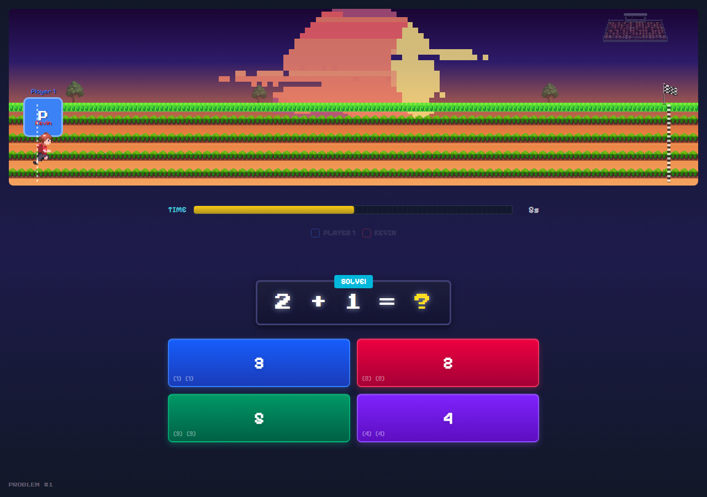
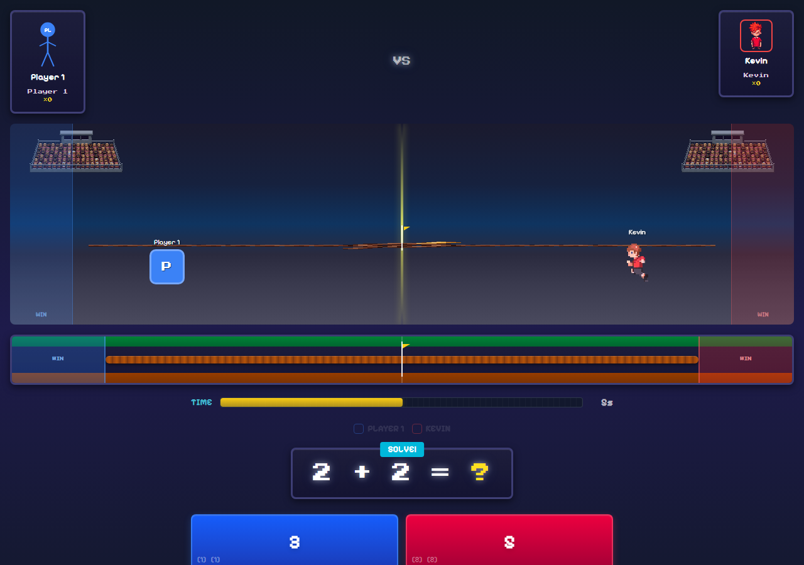
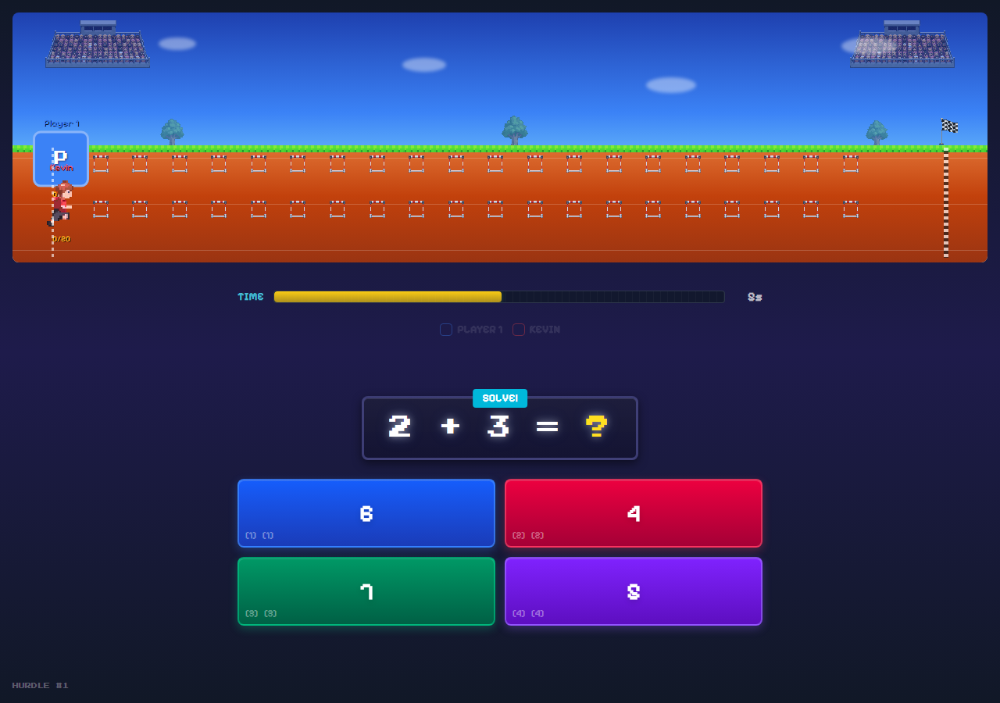
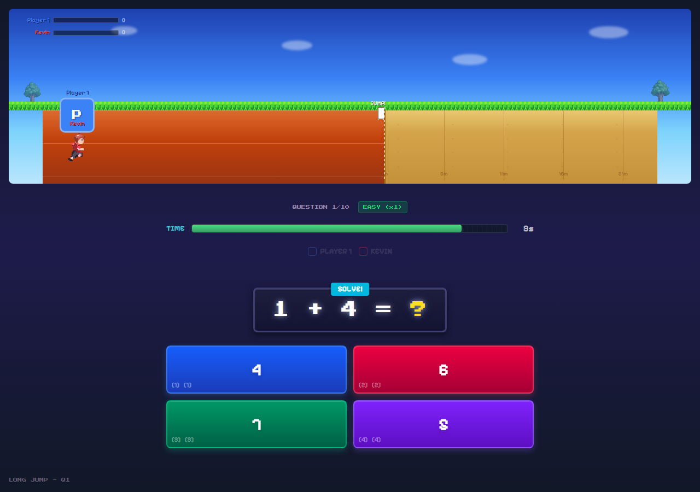
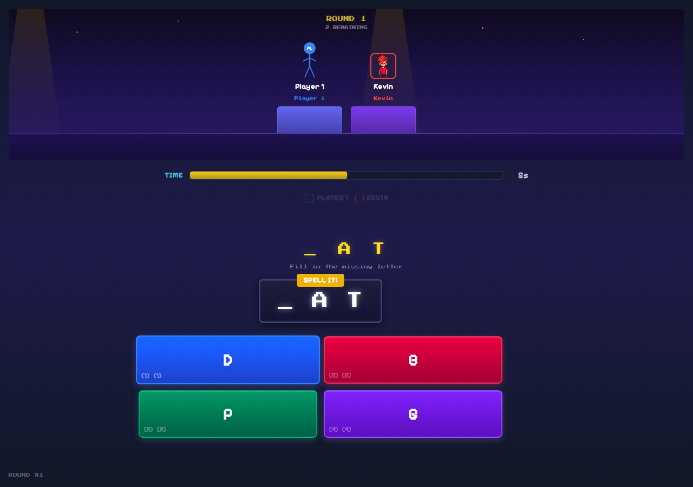

# Knowledge League Kids

A multiplayer educational game where kids answer math, science, reading, and spelling questions to compete in retro pixel art game events. Built with React, TypeScript, and WebRTC for real-time multiplayer on any device.


## Pick Your Opponent


## Game Events

| Event | Description |
|-------|-------------|
|  | **Math Marathon** — Race to the finish line. Correct answers move you forward. |
|  | **Tug of War** — Teams pull a rope. Right answers pull your side closer to victory. |
|  | **Hurdle Dash** — Sprint and jump hurdles by answering quickly and correctly. |
|  | **Long Jump** — Build speed with correct answers, then launch for distance. |
|  | **Spelling Bee** — Listen to words and spell them correctly to score points. |

## Features

- **Multiplayer** — Host a game and players join from their phones via QR code (WebRTC, no server needed)
- **CPU opponents** — Play solo against AI with adjustable difficulty
- **Adaptive difficulty** — Questions get harder or easier based on how the player is doing
- **Multiple subjects** — Math (procedural generation), science, reading comprehension, spelling
- **Grade levels** — Grade 1 through Grade 3, plus an Adult mode
- **AI announcer** — Qwen3 TTS voice commentary with 6 selectable voices
- **Custom characters** — Describe a character and generate pixel art via PixelLab API
- **Retro pixel art** — 16-bit style characters, tilesets, and animations
- **Post-game stats** — Player analytics, superlatives, and trophy shelf

## Quick Start

```bash
# Install dependencies
npm install

# Copy environment file and add your API keys
cp .env.example .env

# Start the dev server
npm run dev
```

Open `http://localhost:5175` in your browser.

## Environment Variables

Copy `.env.example` to `.env` and fill in your keys:

| Variable | Required | Description |
|----------|----------|-------------|
| `REPLICATE_API_TOKEN` | For TTS voices | Powers the Qwen3 AI announcer. Get a token at [replicate.com](https://replicate.com/account/api-tokens) |
| `PIXELLAB_API_KEY` | For custom characters | Generates pixel art from text descriptions. Get a key at [pixellab.ai](https://pixellab.ai) |
| `VITE_PIXELLAB_API_KEY` | For custom characters | Same key as above, prefixed for client-side access |

The game works without any API keys — you just won't have AI voices or custom character generation.

## Multiplayer

1. Click **2 Players** or **4 Players** on the main menu
2. A QR code appears — players scan it on their phones
3. Phone controllers connect via WebRTC (peer-to-peer, no server)
4. Host screen shows the game, phones show answer buttons

## Scripts

```bash
npm run dev          # Vite dev server
npm run build        # TypeScript check + production build
npm run lint         # ESLint
npm test             # Unit tests (Vitest)
npm run test:browser # Playwright E2E tests
```

## Tech Stack

- **React 19** + **TypeScript** + **Vite**
- **Tailwind CSS v4** for styling
- **Zustand** for state management
- **PeerJS** (WebRTC) for multiplayer
- **Vitest** + **Playwright** for testing
- **Qwen3 TTS** via Replicate for AI announcer voices
- **PixelLab API** for AI-generated pixel art

## Project Structure

```
src/
  components/
    Menu/              # Main menu and pixel art menu scene
    MathMarathon/      # Marathon race event
    TugOfWar/          # Tug of war event
    HurdleDash/        # Hurdle dash event
    LongJump/          # Long jump event
    SpellingBee/       # Spelling bee event
    Victory/           # Victory screen
    PostGameStats/     # End-of-game analytics
    PhoneController/   # Mobile player controls
    shared/            # Reusable components (MathProblem, Timer, etc.)
  hooks/               # React hooks (useGameState, useSettings, useCPU, etc.)
  utils/               # Game logic (questionEngine, mathProblems, sounds, etc.)
  data/                # Question banks (JSON) for science, reading, spelling
public/
  pixelart/            # Sprite sheets, tilesets, menu art
  music/               # Background music tracks
  sounds/              # Sound effects
  screenshots/         # Game screenshots
```

## License

MIT
